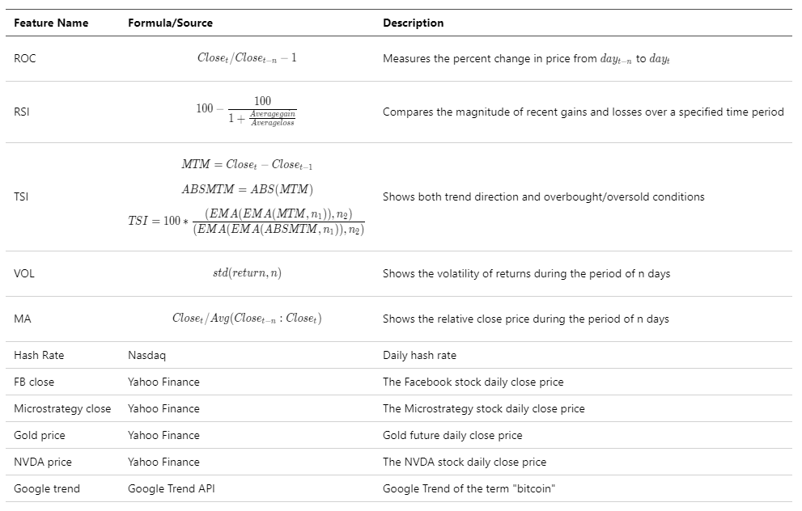
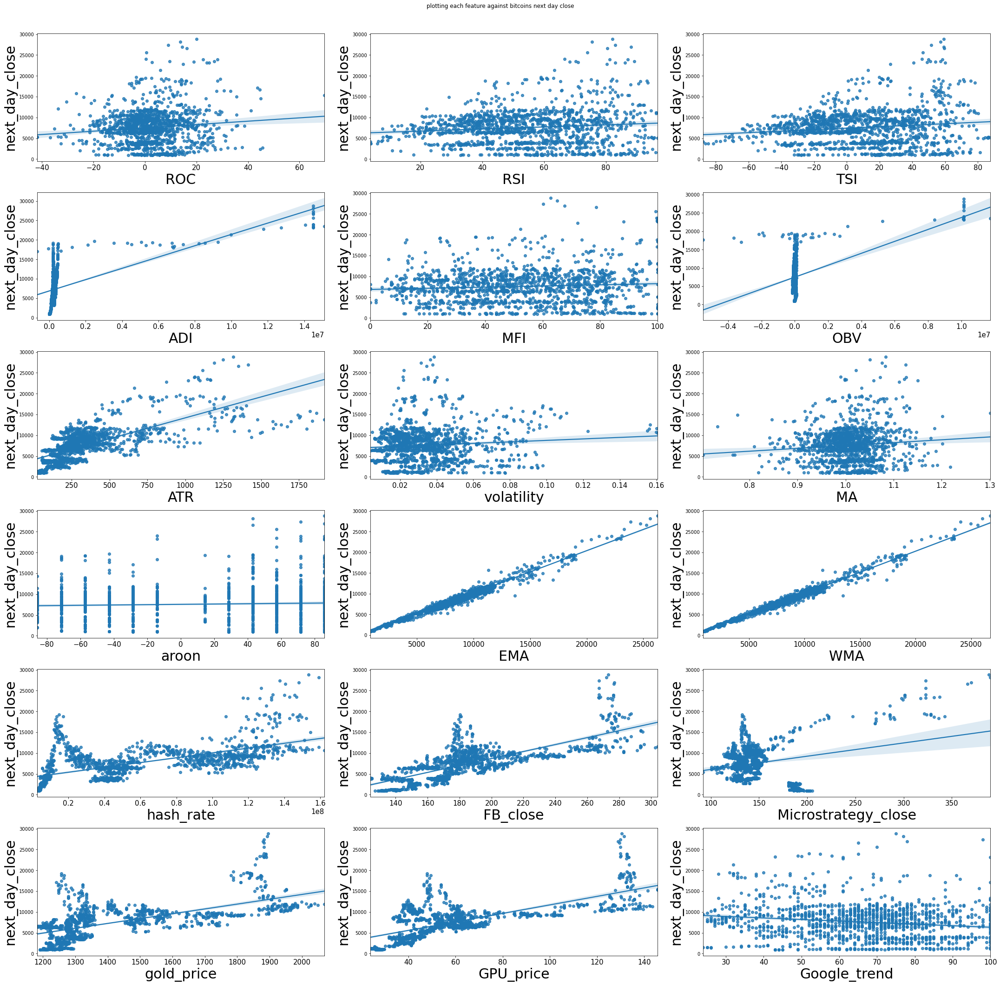
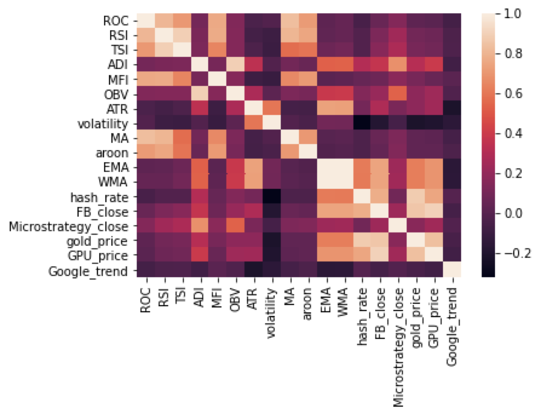

# Midterm Report

## Abstract
We start by describing our cleaned dataset and doing some exploratory data analysis. Then, we try three preliminary regression methods (OLS, Ridge, Logistic). We formulate our question into two separate but related regression problems. The first is a regression problem where we seek to predict next day closing price (which we define as the price at 4 PM on the next day) in order to generate a corresponding trading strategy. The second is a classification problem where our goal is to predict whether the price closes up or down on the following days's close in relation to the following day's open. If it closes green or red, the label is 1 or 0, respectively. Finally, we discusse the methods of testing the effectiveness of our model, how we plan to avoid over/underfitting, and how we plan to continue with the project going forward.

## Data Description and Cleaning

We obtained minute level Bitcoin price data from https://www.CryptoDataDownload.com. We resampled the data, setting 9:00 AM to be the open and 4:00 PM to be the close time. 

We selected some most popular technical factors such as ROC, RSI, MovingAverage and calculated them using open source package ta(technical analysis library) and obtained fundamental factors from online open sources. A detailed description for some sample features is listed below. 

### Description Table of Selected Features:

One problem in our dataset is that Bitcoin is traded 24 hours 7 days a week while stocks are only traded on weekdays, so the data are not aligned on frequency. We filled missing values using the most recent valid values. We set the data from 2017 to 2020 as the training set and the data from 2021 as the test set. We have 18 features in total, so the size of the training dataset is (1440, 18) and the size of the test dataset is (286, 18).

## Exploratory Data Analysis

Below is a grid of histograms corrosponding to each feature we have so far. Most of them don't look very normal, but many of them seem to have some sort of estimable distribution. ROC, RSI, TSI, and MA seem to be more nicely distributed. ATR and volatility exhibit some serious skew. Hash rate and Microstrategy Close seem to be bimodal. 

Next, lets look at how each feature is related to our dependent variable, the next day's close of bitcoin.

Finally, a heatmap for correlation between different features is also shown below. We can see that correlations among technical factors and correlations among fundamental factors are relatively high.

## Preliminary Analysis
We used simple linear regression and ridge regression to predict crypto prices and logistic regression to predict price movements.
The results are as follows:  
  
|          | Train MAE/Accuracy | Test MAE/Accuracy |
|----------|--------------------|-------------------|
| OLS      | 4513.31            | 10427.05          |
| Ridge    | 257.45             | 10436.05          |
| Logistic | 55.2%              | 46.9%             |
  
As we can see from the result, the mean absolute error for regression problems are relatively large and Ridge doesn’t reduce overfitting quite well.  What’s more, the tiny difference between the predicted and real price may lead to huge loss in practice. So instead of predicting price directly, we will try to focus on predicting classification problems (whether the price of bitcoin will go up or down)

The logistic regression doesn’t perform well on the whole dataset and we tried using logistic regression separately on technical factors and fundamental factors. It turned out that the overfitting was mainly caused by technical factors, so this is another issue we want to resolve in the future.

|                              | Train Accuracy | Test Accuracy |
|------------------------------|----------------|---------------|
| Logistic-Technical Factors   | 54.9%          | 45.1%         |
| Logistic-Fundamental Factors | 55%            | 53.1%         |

## Discussion

### 1. Effectiveness & Over/Under-fitting
We seperate the datasets into two parts: training set (from 2017 to 2020) and testing set (2021). For regression models, we could track mean square errors of different models in the two datasets. For classification models, we could track mean misclassification error and AUC to examine effectiveness.  
If the training errors are high, which means the models are underfitting, more features or a more complicated model (e.g. polynomial model) could be considered. If the training errors are low, but the testing errors are high, which means overfitting, we could consider dropping some features to reduce the complexity of models. Other approaches to overfitting we will consider include utilizing dimension reduction methods such as PCA to technical factors and regularization methods such as bagging methods or lasso regularization.

### 2. Future Plan
From the preliminary analysis we have done, the outcomes of regression show that there is some linear relationship between the price and features. However, the tiny difference between the predicted and real price may lead to huge loss in practice. So instead of predicting price directly, we will try to predict returns of Bitcoin. Furthermore, the exact values of returns are not so important, because as long as we know which direction the price will go could we make trading decision. In this case, the problem become a classification one to predict whether the price will go up or down. Thus, in addition to logistic regression we have tried, we will try some other non-linear classifiers such as support vector machine, ensemble methods including random forests, XGBoost and ControlBurn.   

Secondly, since we only have 1500+ data points, cross validation might be incorporated into our framework to evaluate and select best models instead of using testing set directly, in which case we can fully exploit the dataset. We may also consider using Bitcoin price data from further back, assuming we can get the same historical prices for our other features. 

